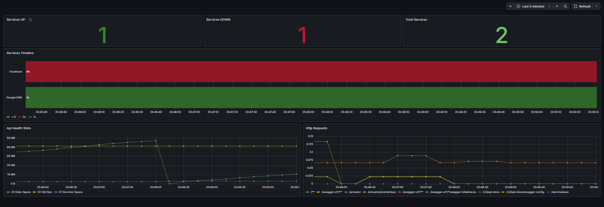

# Helios Observability

Helios Observability é uma API REST desenvolvida em **Java + Spring Boot** para monitoramento de disponibilidade de serviços.

O projeto foi construído com foco em **engenharia backend, arquitetura limpa e modelagem de domínio**, simulando em menor escala funcionalidades encontradas em ferramentas como **Uptime Kuma, Pingdom, Datadog e Prometheus-based monitoring systems**.

Seu principal objetivo é monitorar a disponibilidade de hosts através de **ICMP (Ping)**, registrar eventos operacionais, gerar alertas automaticamente e expor métricas para observabilidade.

---

## Objetivo do Projeto

Este projeto foi desenvolvido como estudo prático de conceitos fundamentais para backend engineering:

- Clean Architecture
- Domain-Driven Design (DDD)
- SOLID
- modelagem de domínio
- observabilidade de sistemas
- monitoramento e incident lifecycle
- testes orientados a regras de negócio
- métricas e dashboards

Mais do que implementar funcionalidades, o objetivo foi exercitar **decisões arquiteturais e separação clara de responsabilidades**, priorizando código desacoplado, testável e evolutivo.

---

## Problema Resolvido

Sistemas distribuídos precisam de mecanismos confiáveis para identificar indisponibilidades rapidamente.

O Helios Observability resolve esse problema através de:

- monitoramento periódico de serviços
- identificação automática de falhas
- geração de alertas
- resolução automática após recuperação
- exposição de métricas operacionais

---

## Principais Funcionalidades

Atualmente o sistema permite:

- monitoramento de hosts via ICMP (Ping)
- registro de estados `UP` e `DOWN`
- geração automática de alertas
- resolução automática quando o serviço volta ao estado saudável
- histórico de eventos de disponibilidade
- métricas expostas via Prometheus
- dashboards prontos no Grafana
- documentação automática via Swagger/OpenAPI

---

## Decisões de Arquitetura

A arquitetura foi projetada utilizando **Clean Architecture + DDD**.

A principal decisão foi **isolar as regras de negócio da infraestrutura e do framework Spring**.

Isso significa que:

> o domínio não depende de controllers, banco de dados, JPA ou detalhes do framework

Essa abordagem melhora:

- testabilidade
- manutenção
- escalabilidade do projeto
- clareza da regra de negócio
- evolução futura

### Estrutura em camadas

```text
src/main/java
├── core
│   ├── domain
│   ├── service
│   └── gateway
│
├── application
│   └── usecases
│
├── infrastructure
│   ├── controllers
│   ├── persistence
│   ├── gateways
│   └── exception
```
## Responsabilidades

### Domain

Contém:

- entidades
- regras de negócio
- invariantes
- transições de estado

Exemplo:

- mudança de status UP / DOWN
- contagem de falhas consecutivas
- resolução automática de alertas

## Application / Use Cases

Responsável por orquestrar fluxos da aplicação.

Exemplo:

- registrar serviço
- executar health checks
- processar mudanças de estado
- acionar incident workflow

## Infrastructure

Camada responsável por detalhes externos:

- persistência
- JPA / PostgreSQL
- integração com Prometheus
- scheduler
- controllers REST
- tratamento HTTP de exceções

## Principais Decisões Técnicas
### 1. Monitoramento via Scheduler

O sistema utiliza um scheduler interno para realizar verificações periódicas.

Essa decisão foi tomada por:

- simplicidade de implementação
- previsibilidade
- fácil evolução para jobs distribuídos

### 2.Estratégia inicial com ICMP

A primeira estratégia implementada foi ICMP Ping.

Escolhi essa abordagem por:

- baixo custo operacional
- simplicidade
- ótima base para evolução

A arquitetura foi preparada para futuras estratégias como:

- HTTP health checks
- TCP socket checks
- Custom probes

Seguindo o princípio Open/Closed.

### 3. Lifecycle de incidentes

O projeto modela o ciclo de vida do serviço monitorado.

Fluxo simplificado:

```UP → DOWN → ALERT → RESOLVED```

Essa modelagem foi pensada para refletir cenários reais de observabilidade.

## Estratégia de Testes

Um dos principais focos do projeto foi manter a regra de negócio altamente testável.

A maior parte da lógica crítica foi mantida no domínio para permitir testes unitários independentes do Spring.

Os testes cobrem cenários como:

- Mudança de estado do serviço
- Reset de contador após recuperação
- Criação automática de alertas
- Resolução de incidentes
- Comportamento do scheduler
- Tratamento de exceções

Exemplo de regra testada:

```contador de falhas consecutivas deve ser resetado após recuperação do serviço```

## Stack Tecnológica
- Java
- Spring Boot
- Spring Web
- Spring Data JPA
- PostgreSQL
- Spring Boot Actuator
- Prometheus
- Grafana
- Docker
- Docker Compose
- Swagger / OpenAPI
- JUnit 5

## Observabilidade

A aplicação expõe métricas via:

```/actuator/prometheus```

Essas métricas são coletadas automaticamente pelo Prometheus.

## Dashboard no Grafana

O projeto inclui provisionamento automático de dashboards.

Ao subir os containers, o dashboard já fica disponível automaticamente.

Métricas exibidas:

- serviços UP
- serviços DOWN
- total monitorado
- linha do tempo de disponibilidade
- uso de memória JVM
- volume de requisições HTTP

Exemplo:



## Como Executar
### Pré-requisitos
- Docker
- Docker Compose

Verifique:

- docker --version
- docker compose version

### Clone o projeto
``` 
git clone https://github.com/Neyzim/helios-observability```
cd helios-observability
```
### Subindo o ambiente
```docker compose up --build ```

### Containers iniciados:

- API
- PostgreSQL
- Prometheus
- Grafana 

### Endpoints

API:

```http://localhost:8080```

Swagger:

```http://localhost:8080/swagger-ui/index.html```

Grafana:

```http://localhost:3000```

## Demo / Quick Start

O projeto já inicializa com serviços de demonstração automaticamente configurados.

Isso permite visualizar o comportamento do sistema imediatamente após subir a aplicação, sem necessidade de cadastro manual.

### Serviços disponíveis

- **Healthy Service**
    - Endpoint: https://google.com
    - Estado inicial: UP

- **Offline Service**
    - Endpoint: offline (simula falha)
    - Estado inicial: UP (irá mudar para DOWN após os checks)

### Como testar o comportamento

Após subir a aplicação:

- Acesse o Grafana: http://localhost:3000
- Observe a transição de estados dos serviços
- O serviço "Offline Service" irá falhar automaticamente

Isso demonstra o funcionamento do sistema de:
- Monitoramento
- Detecção de falhas
- Geração de alertas
- Atualização de métricas

## Aprendizados Técnicos

Durante a construção deste projeto aprofundei conhecimentos em:

- design orientado a domínio
- arquitetura limpa
- observabilidade
- modelagem de incidentes
- tratamento global de exceções
- logging
- testes unitários
- desacoplamento entre domínio e framework

## Próximos Passos

Evoluções planejadas:

- suporte a HTTP checks
- suporte a TCP checks
- retries configuráveis
- SLA breach alerts
- notificações por email/webhook
- autenticação e autorização
- histórico avançado de incidentes

### Sobre o Projeto

Este projeto foi desenvolvido como parte da minha jornada de preparação para minha primeira oportunidade como desenvolvedor backend Java.

O foco principal foi demonstrar:

- capacidade de modelagem
- tomada de decisões arquiteturais
- preocupação com testabilidade
- boas práticas de backend engineering